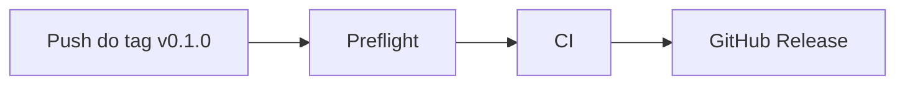

# CI e releases

Como funcionam a integração contínua no GitHub Actions e o processo de release do app.

[← Voltar para a organização do projeto](organizacao-do-projeto.md)

---

## 1. Estrutura de arquivos

```
.
├── .github/
│   ├── pull_request_template.md   # modelo da descrição de pull request
│   ├── scripts/
│   │   └── changelog-section.sh   # extrai a seção de uma versão do CHANGELOG.md
│   └── workflows/
│       ├── ci.yml                 # lint + format + typecheck, testes e Expo Doctor
│       └── release.yml            # pipeline de release disparado por tag
├── docs/
│   └── CI.md                      # este documento
├── CHANGELOG.md                   # histórico de mudanças por versão
└── package.json                   # scripts usados pelos workflows
```

---

## 2. Quando cada workflow roda

| Evento                     | Workflow      | O que roda                                      |
| -------------------------- | ------------- | ----------------------------------------------- |
| Push na `main`             | `ci.yml`      | lint + format + typecheck, testes e Expo Doctor |
| Pull request para a `main` | `ci.yml`      | lint + format + typecheck, testes e Expo Doctor |
| Push de tag `v*.*.*`       | `release.yml` | preflight → `ci.yml` → GitHub Release           |

---

## 3. Os workflows

Todos usam Node 24 e o pnpm na versão do campo `packageManager` do `package.json`, com cache das dependências.

### `ci.yml`

Três jobs em paralelo:

| Job                       | Comandos                                           |
| ------------------------- | -------------------------------------------------- |
| Lint + format + typecheck | `pnpm lint`, `pnpm format:check`, `pnpm typecheck` |
| Testes                    | `pnpm test:cov` (cobertura vai como artefato)      |
| Expo Doctor               | `pnpm run doctor`                                  |

Também pode ser chamado por outros workflows (`workflow_call`), e é assim que o `release.yml` o reaproveita. Se um novo push chegar enquanto um CI anterior da mesma branch ainda está rodando, o anterior é cancelado.

### `release.yml`

Dispara quando um tag `v*.*.*` (ex.: `v0.1.0`) é enviado ao GitHub. Cada etapa só começa se a anterior passou:



1. **Preflight**
   - O tag aponta para um commit que está na `main`.
   - A `version` do `package.json` é a mesma do tag (`v0.1.0` → `0.1.0`).
   - O `CHANGELOG.md` tem a seção `## [0.1.0] - AAAA-MM-DD` com conteúdo.
2. **CI**: reaproveita o `ci.yml`.
3. **GitHub Release**: cria o release com o nome do tag e a seção do CHANGELOG como descrição.

---

## 4. Rodando o mesmo que o CI

```sh
pnpm pr
```

Roda `lint`, `format:check`, `typecheck`, `test:cov` e o Expo Doctor, nessa ordem.

> `pnpm doctor` (sem `run`) chama o diagnóstico do próprio pnpm, não o Expo Doctor. Use `pnpm run doctor`.

---

## 5. CHANGELOG

Segue o [Keep a Changelog](https://keepachangelog.com/pt-BR/1.1.0/) e o [Semantic Versioning](https://semver.org/lang/pt-BR/). Versões `0.x.y` até o app ir para as lojas.

- Mudanças em desenvolvimento ficam em `## [Unreleased]`, no topo.
- Cada versão tem uma seção `## [X.Y.Z] - AAAA-MM-DD`. **O cabeçalho precisa seguir exatamente esse formato**, porque é ele que o pipeline procura.
- Categorias: `Added`, `Changed`, `Deprecated`, `Removed`, `Fixed`, `Security`. Use só as que tiverem conteúdo.
- Escreva para quem usa o app: o que mudou na tela, não detalhes internos.

---

## 6. Como lançar uma versão

1. No `CHANGELOG.md`, mova o conteúdo de `[Unreleased]` para `## [0.1.0] - AAAA-MM-DD` e deixe `[Unreleased]` vazio.
2. Atualize a versão (o `app.config.ts` lê dali):

   ```sh
   pnpm version 0.1.0 --no-git-tag-version
   ```

3. Commit, tag e push:

   ```sh
   git commit -am "version: release v0.1.0"
   git tag v0.1.0
   git push origin main v0.1.0
   ```

4. Acompanhe na aba **Actions**. Se tudo passar, o release aparece em **Releases**.

---

## 7. Problemas comuns

| Erro                                                   | Causa                                                      | Como resolver                                                   |
| ------------------------------------------------------ | ---------------------------------------------------------- | --------------------------------------------------------------- |
| `CHANGELOG.md não tem a seção ## [X.Y.Z] - AAAA-MM-DD` | Seção ausente, vazia ou com cabeçalho em outro formato     | Corrija o CHANGELOG, apague e recrie o tag                      |
| `O tag vX.Y.Z não aponta para um commit da main`       | O tag foi criado em outra branch                           | Apague o tag, faça o merge na `main` e recrie                   |
| `package.json está na versão A, mas o tag é vB`        | Faltou o `pnpm version`                                    | Atualize o `package.json`, faça o commit, apague e recrie o tag |
| Falha no lint ou no format check                       | Aviso do oxlint ou código não formatado                    | `pnpm lint:fix` / `pnpm format`, commit e push                  |
| Expo Doctor reclama de versão                          | Lib instalada com `pnpm add` em vez de `pnpm expo install` | `pnpm expo install --fix`                                       |

Para apagar e recriar um tag:

```sh
git tag -d v0.1.0 && git push origin :refs/tags/v0.1.0
git tag v0.1.0 && git push origin v0.1.0
```
